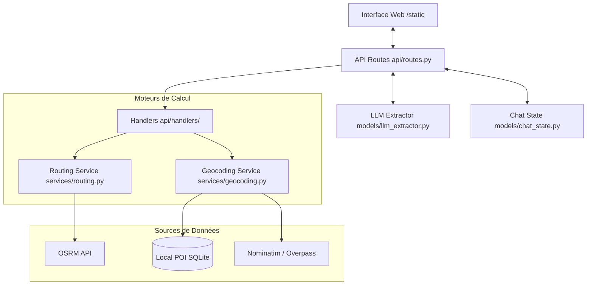
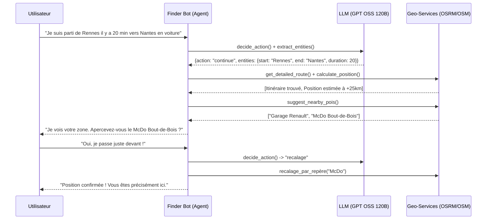

# 🧭 Rapport d'Analyse : Finder Bot

## 📝 Présentation Générale
**Finder Bot** est un assistant intelligent conçu pour aider les Assistants de Régulation Médicale (ARM) à géolocaliser des personnes égarées. Son originalité réside dans son approche **hybride** : il combine un chatbot conversationnel (LLM local via Ollama) et des moteurs géographiques (OSRM, OSM) pour transformer des descriptions floues en coordonnées précises.

---

## 🏗️ Architecture Technique et Liaisons
Le projet suit une architecture modulaire basée sur **FastAPI**. Voici comment les composants interagissent :

### Rôles des composants :
1.  **api/routes.py** : Le chef d'orchestre. Il reçoit les messages, consulte le LLM, et appelle les handlers spécialisés.
2.  **models/llm_extractor.py** : L'intelligence. Il utilise un LLM (gpt-oss 120b/Ollama) pour :
    - **Décider** de l'action à prendre (Agentic Decision).
    - **Extraire** les entités (villes, durée, repères visuels).
3.  **models/chat_state.py** : La mémoire vive. Il stocke le trajet, le niveau de confiance et l'historique.
4.  **services/** : Les bras armés. `routing.py` calcule les itinéraires et `geocoding.py` interroge la base locale (12M de POI) ou le web.

---

## 💬 Flux Conversationnel Agentique
Le système ne se contente pas de répondre ; il suit un cycle de décision pour affiner la position.

---

## 🛠️ Mécanismes Clés

### 1. Le Recalage (Doubt Removal)
C'est le cœur du projet. Au lieu de se fier uniquement au GPS (souvent absent ou imprécis lors d'un appel 15), le bot :
- Calcule la position théorique : `Vitesse_Moyenne_OSRM * Temps_Écoulé`.
- Scanne les **POI (Points d'Intérêt)** autour de cette position dans la base SQLite locale.
- Pose une question de confirmation à l'utilisateur pour "recaler" la position sur un point physique réel.

### 2. L'Extraction Hybride
Le bot combine **Regex** et **LLM** pour une robustesse maximale :
- **Regex** : Extraction ultra-fiable des durées (ex: "1h30") et des formats de routes (ex: "N12").
- **LLM** : Compréhension du langage naturel pour les lieux et les intentions (ex: "Je suis perdu", "Non pas celui-là").

### 3. Base de Données Locale
Le service `geocoding.py` priorise une base **SQLite locale** (`data/pois_local.db`). Cela permet un fonctionnement ultra-rapide et potentiellement offline, essentiel pour des applications critiques de secours.

---

## 📈 Évolutions Possibles
- **Multi-modalité** : Intégration de la reconnaissance vocale pour traiter directement l'audio des appels.
- **Prise en compte du trafic** : Coupler OSRM avec des données de trafic en temps réel pour affiner la vitesse moyenne.
- **Mode Offline total** : Embarquer un moteur de routage local (Valhalla ou GraphHopper) pour s'affranchir de toute connexion internet.
